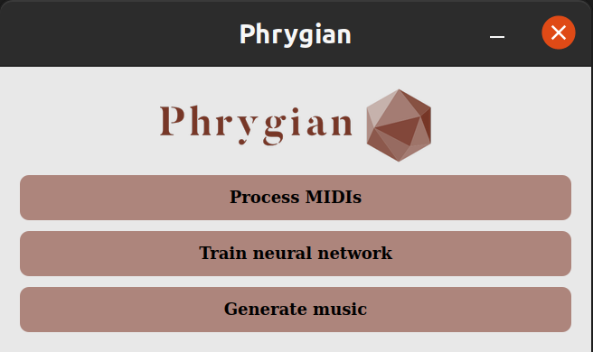
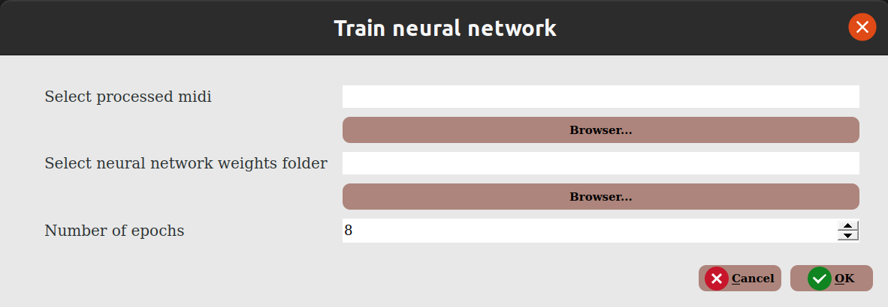
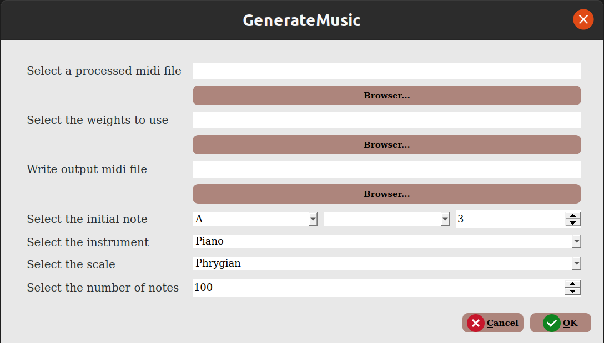

# Phrygian - An Artificial Intelligence system for Music Composition <!-- omit in toc -->

## Table of Contents  <!-- omit in toc -->
- [Authors](#authors)
- [Guide](#guide)
- [Requirements](#requirements)
- [Download](#download)
- [Execution](#execution)
  - [Phrygian CLI](#phrygian-cli)
    - [Main program](#main-program)
    - [Process midi files](#process-midi-files)
    - [Train neural network](#train-neural-network)
    - [Generate music](#generate-music)
  - [Phrygian GUI](#phrygian-gui)
    - [Main program](#main-program-1)
    - [Process midi files](#process-midi-files-1)
    - [Train neural network](#train-neural-network-1)
    - [Generate music](#generate-music-1)
- [Appendix](#appendix)

## Authors
  * Daniel del Castillo de la Rosa
  * José Daniel Escánez Expósito
  * Nerea Rodríguez Hernández
  
## Guide
Using Phrygian you can create music from some example melodies. Three steps are needed:
1. Processing. MIDI files need to be processed. The result is stored in a file, so you don't need to repeat it with each training.
2. Train. The training process uses the file produced by the first step and produces some weights for a neural network.
3. Generation. You can now generate some music with the processed file from step 1 and a weigths file from step 2.
**Note**: In step 3 you **must** use weights generated with the same processed MIDI file you are using.

Phrygian has been tested and has had good results using near 50 MIDI files. The quality of the results might vary depending of the number of MIDIS, their number of tracks and total notes.

## Requirements
  * [Python 3](https://www.python.org/downloads/)
    * Packages:
      - [tensorflow](https://www.tensorflow.org/install)
      - [music21](https://web.mit.edu/music21/doc/installing/)
      - [keras](https://keras.io/about/#installation-amp-compatibility)
      - [numpy](https://numpy.org/install/)
      - [pyqt5](https://pypi.org/project/PyQt5/) `(Optional: Needed for the GUI)`
  * [MuseScore 3](https://musescore.org/en/download) `(Optional: Needed to visualize the generated music)`

A `pipfile` is provided so it is easy to install the dependencies using [pipenv](https://pipenv.pypa.io/en/latest/). 

## Download

```bash
$ git clone https://github.com/alu0101215693/Phrygian.git
```

## Execution
### Phrygian CLI
#### Main program
```bash
$ src/phrygian.py [-h|--help] process|train|generate
```
#### Process midi files
```bash
$ src/phrygian.py process [-h|--help] <midi files folder> <output file>
```
#### Train neural network
```bash
$ src/phrygian.py train <processed midis file> <neural network weights folder> <number of epochs>
```
#### Generate music
```bash
$ src/phrygian.py generate <processed midis file> <neural networks weights> <output midi file>

Optional arguments should be added at the end
Initial pitch (Default A3): [(-p|--pitch) <pitch>] 
Instrument (Default Piano): [(-i|--instrument) <instrument>]
Scale (Default Chromatic): [(-s|--scale) <scale>] 
Number of notes (Default 100): [(-n|--notes) <number of notes>] 
```
  * See [Appendix](#appendix) for available instruments and scales

### Phrygian GUI
#### Main program
```bash
$ src/phrygian_gui.py
```

#### Process midi files

#### Train neural network

#### Generate music


## Appendix
* Available instruments: 
```
Accordion, AcousticBass, AcousticGuitar, Agogo, Alto, AltoSaxophone, Bagpipes,
Banjo, Baritone, BaritoneSaxophone, Bass, BassClarinet, BassDrum, BassTrombone,
Bassoon, BongoDrums, BrassInstrument, Castanets, Celesta, Choir, ChurchBells,
Clarinet, Clavichord, Conductor, CongaDrum, Contrabass, Contrabassoon, Cowbell,
CrashCymbals, Cymbals, Dulcimer, ElectricBass, ElectricGuitar, ElectricOrgan,
ElectricPiano, EnglishHorn, FingerCymbals, Flute, FretlessBass, Glockenspiel,
Gong, Guitar, Handbells, Harmonica, Harp, Harpsichord, HiHatCymbal, Horn,
Kalimba, KeyboardInstrument, Koto, Lute, Mandolin, Maracas, Marimba,
MezzoSoprano, Oboe, Ocarina, Organ, PanFlute, Percussion, Piano, Piccolo,
PipeOrgan, PitchedPercussion, Ratchet, Recorder, ReedOrgan, RideCymbals,
Sampler, SandpaperBlocks, Saxophone, Shakuhachi, Shamisen, Shehnai, Siren,
Sitar, SizzleCymbal, SleighBells, SnareDrum, Soprano, SopranoSaxophone,
SplashCymbals, SteelDrum, StringInstrument, SuspendedCymbal, Taiko, TamTam,
Tambourine, TempleBlock, Tenor, TenorDrum, TenorSaxophone, Timbales, Timpani,
TomTom, Triangle, Trombone, Trumpet, Tuba, TubularBells, Ukulele,
UnpitchedPercussion, Vibraphone, Vibraslap, Viola, Violin, Violoncello,
Vocalist, Whip, Whistle, WindMachine, Woodblock, WoodwindInstrument, Xylophone
```

* Available scales:
```
Chromatic, Octatonic, Hexatonic-Whole-Tone, Hexatonic-Blues, Pentatonic,
Pentatonic-Blues, Neapolitan-Major, Neapolitan-Minor, Flamenco, Minor, Ionian,
Dorian, Phrygian, Lydian, Mixolydian, Aeolian, Locrian, Enigma
```
